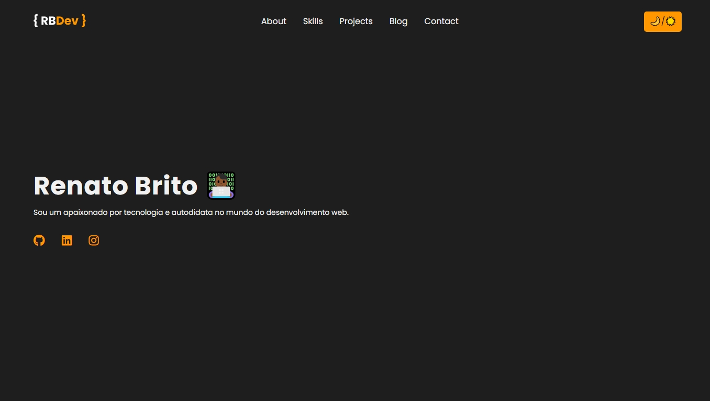

# Portfólio / Renato Brito 👋🏽

## Sobre

Sou um entusiasta de tecnologia e autodidata apaixonado por **desenvolvimento web**. Meu primeiro contato com programação foi em 2019, quando ingressei na faculdade de **Análise e Desenvolvimento de Sistemas** pela Anhanguera. Infelizmente não pude concluir o curso.

Atualmente, me especializo em JavaScript e suas principais tecnologias, como **Node.js**, **React.js** e **Next.js**, desenvolvendo soluções web modernas e funcionais. Meu foco está em criar interfaces intuitivas e experiências digitais que façam a diferença para os **usuários**. Meu objetivo é me tornar **Desenvolvedor Full Stack**. Quero colaborar com projetos impactantes e inovadores, crescer profissionalmente enquanto busco aprender continuamente, expandir meu portfólio e transformar ideias em realidade por meio da tecnologia.

### Frontend

- HTML, CSS, JavaScript, TypeScript, React

### Backend

- Node.js, MongoDB, PostgreSQL

### Ferramentas

- Visual Studio Code, Cmder

### Setup

- Laptop Dell Series 3000 - i3 2GB RAM 1T HD

## Objetivos :dart:

Sonho em desbravar o mundo desde criança. Acredito que a tecnologia
pode proporcionar voos altos. Abre um mundo de possibilidades, nos
leva a conhecer pessoas engajadas no mesmo processo de aprendizado e
conquista de objetivos mútuos. Quero participar de projetos onde eu
possa lapidar minhas habilidades, e também contribuir com a
comunidade.

### Me encontre nas redes

- [Github](https://github.com/renatobritodev)
- [Linkedin](https://www.linkedin.com/in/renatobritodev/)
- [Discord](https://discord.gg/#8522)
- [Email](mailto:dev.renatobrito@gmail.com)
- [Instagram](https://instagram.com/renatobrito.dev)

### Estrutura de pastas

portfolio/
├── backend/
├── frontend/
|-- README.md

### Fonte

[Google Fonts](https://fonts.google.com/specimen/Poppins)
`Poppins, serif;`

### Cores

`--black: #121212;`
`--white: #f1f1f1;`
`--gray: #1e1e1e;`
`--orange: #ff9800;`
`--red-light: #f8d7da;`
`--red-dark: #842029;`
`--green-light: #d1e7dd;`
`--green-dark: #0f5132;`
